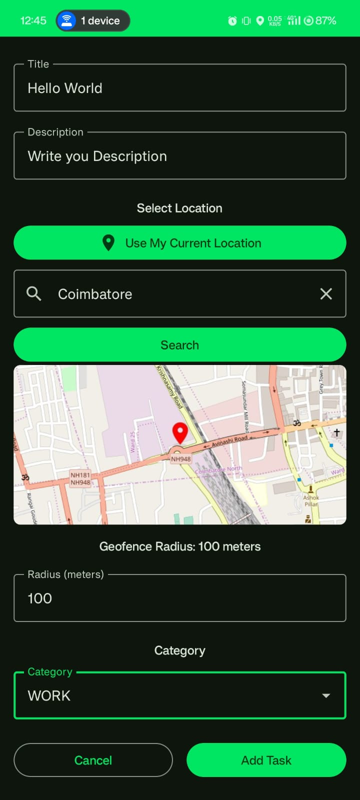
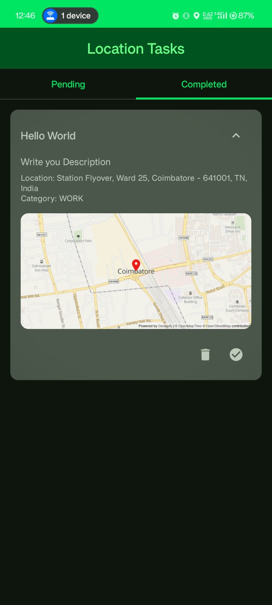

# GeoTasker – Location‑Based Task Manager

## Overview

GeoTasker is a smart, location‑aware task manager that helps you stay on top of your to‑dos by tying them to places. Whether you need to pick up groceries when you’re near the store, remember to return library books when you’re close to campus, or get a gentle reminder to water the plants when you’re at home, GeoTasker has you covered.

---

## 🖼️ App Screenshots

  
  
  

---

## 🚀 Key Features

- **Geofencing** – Create circular "reminder zones" around any address or coordinate.  
- **Map Integration** – Visualize tasks on an interactive map (Google Maps / Mapbox).  
- **Smart Alerts** – Get notified when you approach or depart a task location.  
- **Categorization & Filters** – Tag tasks (e.g., Shopping, Work, Home) and filter by tag, date, or distance.  
- **Sync & Backup** – Optional cloud sync through Firebase / REST API.  
- **Customization** – Set custom reminder radius, notification tone, and working hours.

---

